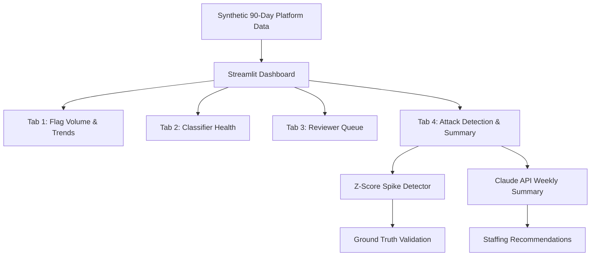
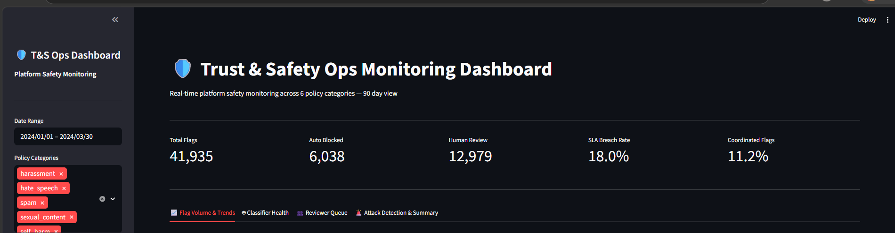
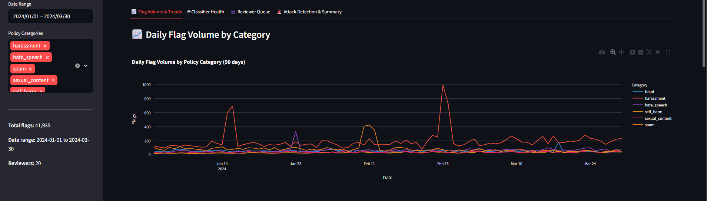
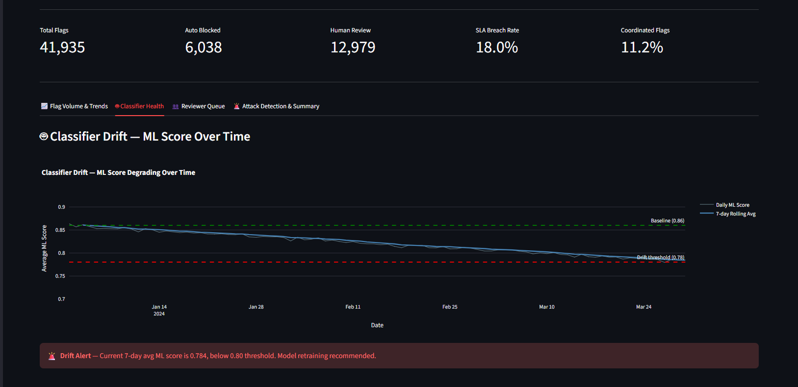
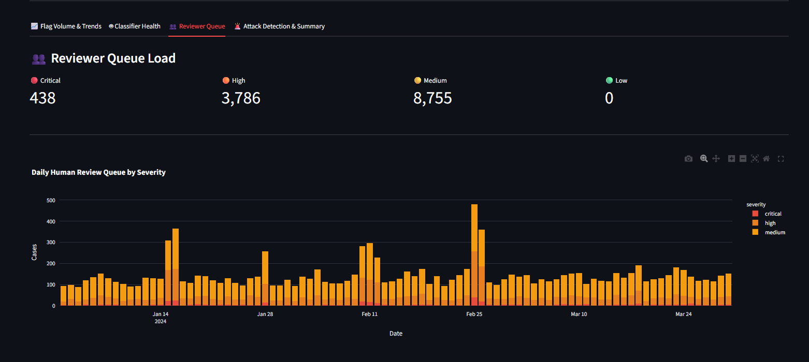
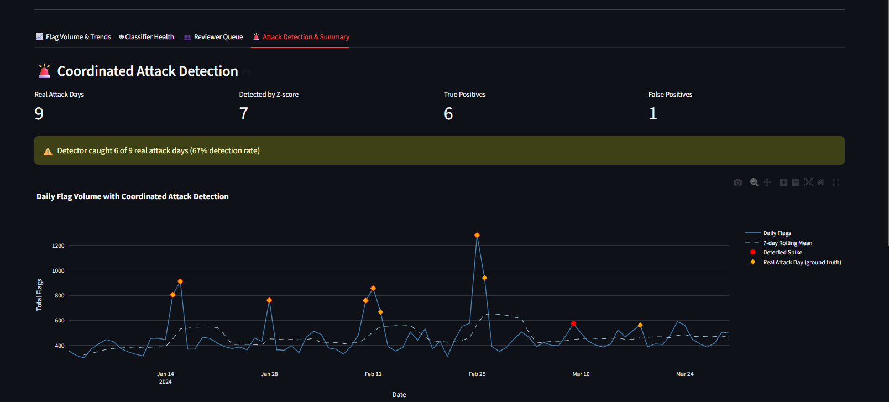
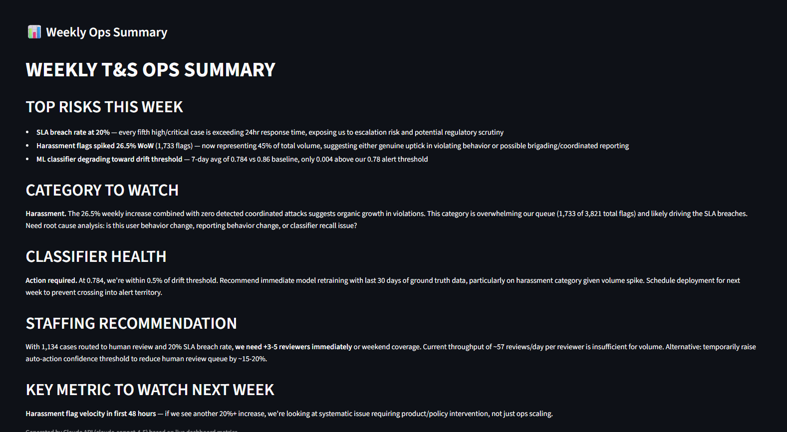

# 🛡️ Trust & Safety Ops Monitoring Dashboard

A production-style Trust & Safety operations dashboard simulating what a T&S team monitors weekly. Built with synthetic 90-day platform data across 6 policy categories.

**Built for:** Google T&S / Analytics Engineer roles  
**Stack:** Python · Streamlit · Plotly · Claude API · Pandas · NumPy

---

## 🎯 Problem

Trust & Safety is not just about building models — it's about operating them. T&S teams need to monitor flag volume trends, detect classifier drift, manage reviewer capacity, identify coordinated attacks, and communicate risks to leadership weekly. This dashboard simulates that entire ops workflow.

---

## 📊 Key Metrics (90-Day View)

| Metric | Value |
|--------|-------|
| Total flags analyzed | 41,935 |
| Auto blocked | 6,038 |
| Sent to human review | 12,979 |
| SLA breach rate (high/critical) | 18.0% |
| Coordinated attack flags | 11.2% |
| Classifier drift (start → end) | 0.86 → 0.784 |
| Attack detection rate | 67% (6/9 events) |
| Attack detection precision | 86% (1 false positive) |

---

## 🏗️ System Architecture



---

## 📸 Screenshots

### Dashboard Header — Platform Health at a Glance


### Tab 1 — Daily Flag Volume by Category


### Tab 2 — Classifier Drift Detection


### Tab 3 — Reviewer Queue Load


### Tab 4 — Coordinated Attack Detection


### Tab 4 — AI-Generated Weekly Ops Summary


---

## 🔍 Dashboard Features

### Tab 1 — Flag Volume & Trends
- Daily flag volume by policy category over 90 days
- Week-over-week % change per category
- Escalation rate over time (% high/critical flags)
- Severity and moderation action distribution

### Tab 2 — Classifier Health
- ML score drift from 0.86 baseline to 0.784 over 90 days
- 7-day rolling average with drift threshold alert
- ML score distribution by policy category (box plots)
- Calibration check — ML score vs severity level

### Tab 3 — Reviewer Queue
- Current backlog by severity (critical/high/medium/low)
- Daily human review queue stacked by severity
- Per-reviewer utilization with 100% capacity line
- SLA risk — high/critical cases exceeding 24hr threshold

### Tab 4 — Attack Detection & Weekly Summary
- Z-score spike detector (threshold = 1.5 std above rolling mean)
- Ground truth validation — 67% recall, 86% precision on 5 real attack events
- Known attack events table with patterns and account counts
- Claude API weekly ops summary with staffing recommendations

---

## 🚨 Coordinated Attack Detection

The z-score detector identifies coordinated attacks by flagging days where flag volume exceeds 1.5 standard deviations above the 7-day rolling mean.

**Ground truth validation:**
- 5 real attack events seeded in synthetic data (9 attack days total)
- Detector caught 6 of 9 attack days (67% recall)
- Only 1 false positive (86% precision)

**Interview answer:** *"A simple z-score detector achieves 67% recall with 86% precision. The 3 missed attacks were lower-intensity events where volume didn't spike sharply above baseline. In production you'd layer secondary signals — account age correlation, content similarity, target overlap — to catch those."*

---

## 🤖 Claude API Weekly Summary

The "Generate Weekly Summary" button calls Claude API with real dashboard metrics and returns a structured ops report covering:

- Top risks with specific numbers
- Category to watch and why
- Classifier health assessment
- Staffing recommendation (reviewer count)
- Key metric to watch next week

This simulates how T&S teams automate weekly leadership reporting.

---

## 📁 Synthetic Dataset Design

**Why synthetic:** T&S dashboards run on platform-specific internal data. Synthetic data with realistic patterns demonstrates the same analytical thinking as real data.

**Realistic patterns baked in:**
- Weekend spikes — 25% more flags on Fri/Sat/Sun
- Category trends — harassment trending up (+0.8/day), spam trending down (-0.5/day)
- Classifier drift — gradual degradation from 0.86 to 0.78 over 90 days with daily noise
- Coordinated attacks — 5 attack events with 3-5x volume spikes, coordinated_flag=True for ground truth
- SLA pressure — 18% of high/critical cases exceed 24hr resolution target

---

## 🛠️ Setup

```bash
git clone https://github.com/yourusername/ts-ops-dashboard
cd ts-ops-dashboard
pip install -r requirements.txt
```

Add your Anthropic API key to `.env`:
ANTHROPIC_API_KEY=sk-ant-...

Generate synthetic data:
```bash
# Run notebooks in order
notebooks/01_generate_data.ipynb
```

Launch dashboard:
```bash
streamlit run app.py
```

---

## 📁 Project Structure

```text
ts-ops-dashboard/
├── data/
│   ├── flags.csv          # 41,935 synthetic flag records across AMER/EMEA/APAC
│   ├── reviewers.csv      # 20 reviewers
│   └── attacks.csv        # 5 ground truth attack events
├── notebooks/
│   └── 01_generate_data.ipynb   # Synthetic data generation
├── assets/                # Dashboard screenshots
├── app.py                 # Streamlit dashboard
├── .env                   # API key (never committed)
├── .gitignore
├── requirements.txt
└── README.md
```
---

## 💡 Key Design Decisions

**Why synthetic data?** Real T&S data is confidential. Synthetic data with realistic patterns — weekend spikes, category trends, attack events — demonstrates the same analytical thinking while being shareable.

**Why z-score for attack detection?** Simple, interpretable, and realistic. Production systems use more sophisticated methods but z-score is a valid first-pass detector that a T&S team would actually deploy.

**Why Claude for weekly summary?** T&S teams generate weekly reports for leadership. Automating this with Claude demonstrates LLM API integration for ops use cases, not just classification.

**Why 18% SLA breach rate?** Realistic. Most T&S teams operate under capacity pressure. A 0% breach rate would look fake.

---

## 🎓 Related Projects

- **Project 1:** [AI Content Safety Classifier](https://github.com/ankitasaha34/content-safety-classifier) — ML + Claude API for content moderation
- **Project 3:** T&S Analyst Copilot — Natural language to SQL for T&S investigation (coming soon)
